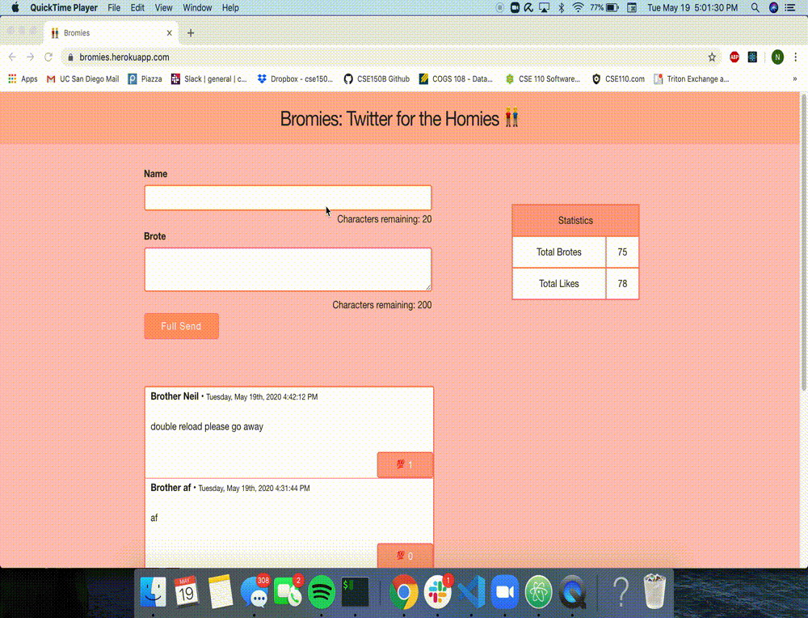

# Bromies
A full-stack twitter clone built using React on the front-end, Node.js with Express on the back-end, and MongoDB as the database. The app is currently up and running as of May 15, 2020, and was deployed using heroku.
  
Features include:  
* Writing and posting brotes (tweets!) instantly
* Live database updating/fast page rendering on submission
* Live database statistics
* Liking and unliking a brote
* Infinite scrolling
 
  
I created this application to educate myself on web development, as I have never done anything like this before. I taught myself how to create responsive pages on the client side using React, and how to read and write APIs on my server through Node.js. I also wanted to learn how to perform CRUD operations with an online database, and how to use this to serve my application. I finally managed to deploy my app online, and learned how to read website logs and how to maintain my MongoDB cluster. 
  
Technologies used:  

[React](https://reactjs.org/)  
[Node.js](https://nodejs.org/en/)  
[Express.js](https://expressjs.com/)  
[Mongoose](https://mongoosejs.com/)  
[MongoDB Atlas](https://www.mongodb.com/cloud/atlas)  
[Heroku Deploy](https://dashboard.heroku.com/)  
